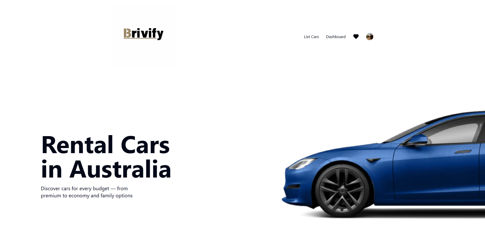
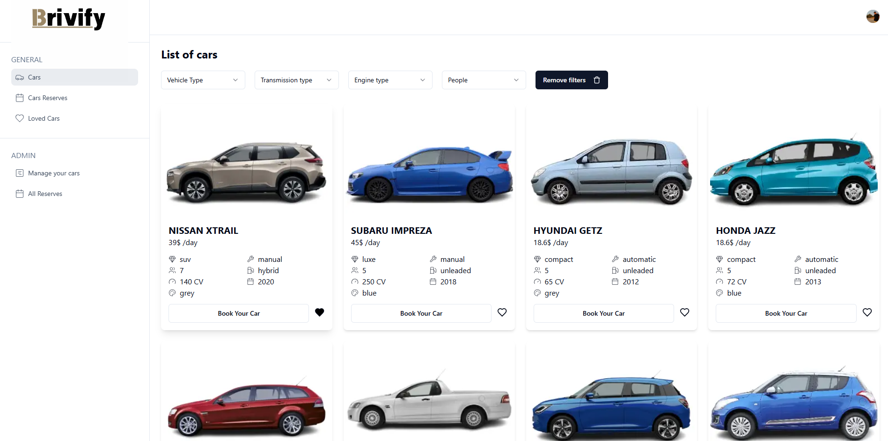
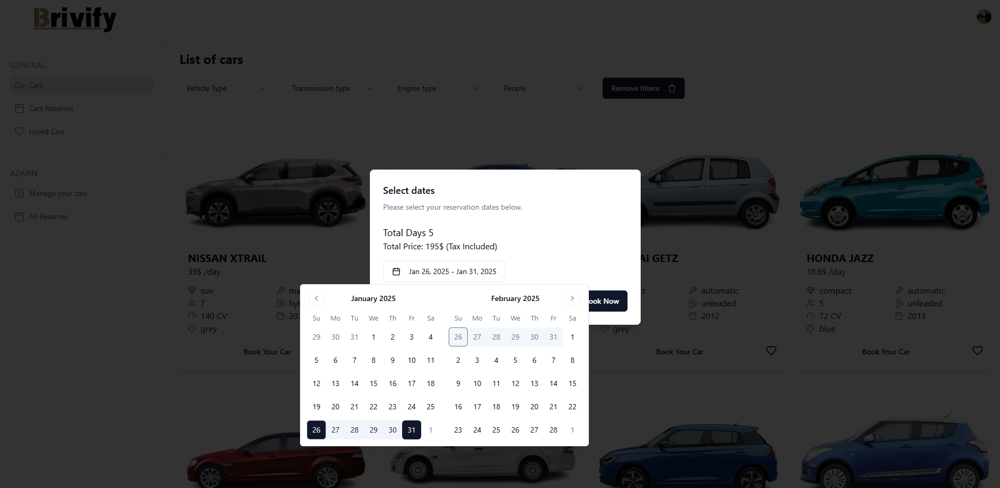
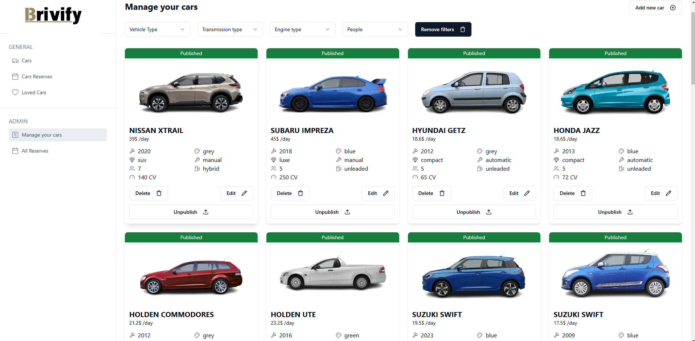

# 🚗 Brivify - Rental Cars in Brisbane

**A modern platform for renting cars in Brisbane**  
Discover, book, and pay securely for cars with an efficient and user-friendly experience.

---

## 🛠️ Technologies

  
  
  
  

---

## 🌟 Features

- **Advanced Search:** Filter cars by location, type, and price range.
- **Secure Bookings:** Integrated **Stripe** payments for fast and reliable transactions.
- **Robust Database Management:** Powered by **PostgreSQL** through **Neon.tech** and managed using **Prisma** for a seamless and scalable experience.
- **Modern Design:** A sleek, responsive UI built with **TailwindCSS** for consistent styling across devices.
- **Reusable Components:** Developed using **Shadcn** to ensure clean, reusable, and efficient components.
- **Smooth Animations:** Enhanced user experience with **Framer Motion** for interactive and dynamic animations.
- **State Management:** Simplified and efficient state handling using **Zustand**.
- **API Integration:** Communication with the backend is handled seamlessly using **Axios**.
- **User Authentication:** Secured and streamlined authentication provided by **Clerk**.
- **File Management:** File uploads and storage powered by **UploadThing** for reliability and performance.

---

## 🌐 Demo

Test the project here: [Brivify Rental Cars](https://brivify-rental-cars-ivan-naharro.vercel.app)

---

## 📸 Screenshots

### Homepage

### Dashboard

### Rental Process

### Admin Dashboard

---

## 🏷️ License

This project is available to everyone under the philosophy: **"For the Players."**  
Feel free to explore, learn, and build upon it!

## 📬 Contact

If you have any questions, feedback, or suggestions about this project, feel free to reach out:

- **Email:** [ivannaharrojimenez@gmail.com](ivannaharrojimenez@gmail.com)
- **LinkedIn:** [www.linkedin.com/in/ivan-nj](www.linkedin.com/in/ivan-nj)
- **GitHub Issues:** Open an issue in this repository if you encounter any bugs or have feature requests.

I'm always happy to connect and collaborate!
